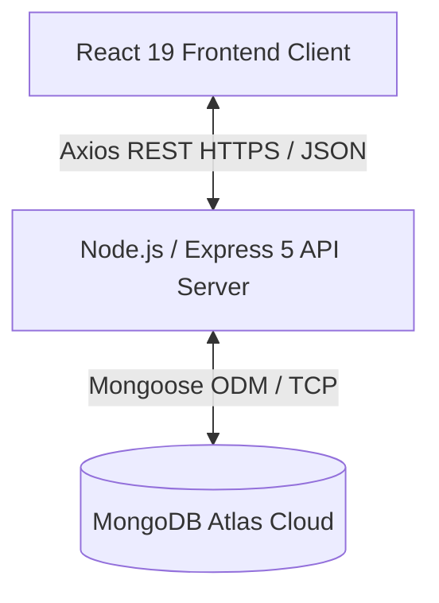
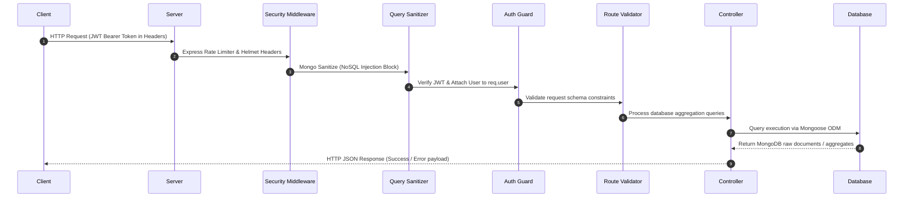
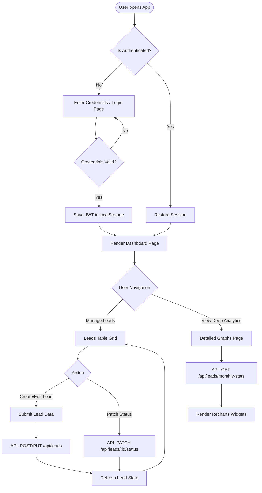

# Startup CRM Lite

<div align="center">
  
  
  <p align="center">
    A lightweight, ultra-fast, and secure MERN-stack Sales CRM tailored for early-stage startups.
  </p>

  [](https://react.dev/)
  [](https://tailwindcss.com/)
  [](https://expressjs.com/)
  [](https://www.mongodb.com/)
  [](https://opensource.org/licenses/ISC)
  []()
</div>

---

## Table of Contents

1. [Project Overview](#project-overview)
2. [Problem Statement](#problem-statement)
3. [Vision & Objectives](#vision--objectives)
4. [Key Features](#key-features)
5. [Target Users](#target-users)
6. [Use Cases](#use-cases)
7. [Business Value](#business-value)
8. [Screenshots](#screenshots)
9. [System Architecture](#system-architecture)
   - [High-Level Architecture Overview](#high-level-architecture-overview)
   - [Application Workflow](#application-workflow)
   - [End-to-End User Flow](#end-to-end-user-flow)
10. [Technology Stack](#technology-stack)
11. [Project Folder Structure](#project-folder-structure)
    - [Folder Directory Structure](#folder-directory-structure)
    - [Folder Explanations](#folder-explanations)
    - [Key Configuration and Code Files](#key-configuration-and-code-files)
12. [Frontend Architecture](#frontend-architecture)
13. [Backend Architecture](#backend-architecture)
14. [Database Architecture & Indexing](#database-architecture--indexing)
15. [API Overview](#api-overview)
16. [Authentication & Authorization](#authentication--authorization)
17. [State & Context Management](#state--context-management)
18. [Storage Strategy](#storage-strategy)
19. [Third-Party Services & Integrations](#third-party-services--integrations)
20. [AI & Automation Components](#ai--automation-components)
21. [Development Prerequisites](#development-prerequisites)
22. [Installation Guide](#installation-guide)
23. [Environment Variables (.env) Documentation](#environment-variables-env-documentation)
24. [Project Configuration](#project-configuration)
25. [Running the Project](#running-the-project)
    - [Local Development](#local-development)
    - [Production Run](#production-run)
26. [Build Process](#build-process)
27. [Deployment Guide](#deployment-guide)
28. [CI/CD Overview](#cicd-overview)
29. [Testing Strategy](#testing-strategy)
30. [Debugging Tips](#debugging-tips)
31. [Logging & Monitoring](#logging--monitoring)
32. [Security Considerations](#security-considerations)
33. [Performance Optimizations](#performance-optimizations)
34. [Coding Standards & Project Conventions](#coding-standards--project-conventions)
35. [Versioning Strategy](#versioning-strategy)
36. [Branching Strategy](#branching-strategy)
37. [Contribution Guidelines](#contribution-guidelines)
38. [Release Process](#release-process)
39. [Known Limitations](#known-limitations)
40. [Future Roadmap](#future-roadmap)
41. [Frequently Asked Questions (FAQ)](#frequently-asked-questions-faq)
42. [Troubleshooting Guide](#troubleshooting-guide)
43. [Changelog](#changelog)
44. [License](#license)
45. [Credits & Acknowledgements](#credits--acknowledgements)
46. [Contact Information](#contact-information)
47. [Final Project Summary](#final-project-summary)

---

## Project Overview

**Startup CRM Lite** is a lightweight, responsive, and visually optimized single-tenant Customer Relationship Management (CRM) application designed explicitly for early-stage companies and small sales teams. The application simplifies the management of sales leads, visualizes pipelines, and performs real-time analytics calculations without the clutter of enterprise software. Built using the **MERN** stack (MongoDB, Express, React 19, Node.js) and styled using the next-generation **Tailwind CSS v4** engine, Startup CRM Lite provides instant access to pipeline status, contact sheets, acquisition source metrics, and conversion rates.

---

## Problem Statement

Early-stage startups and lean teams are slowed down by standard enterprise CRM platforms like Salesforce or HubSpot. These solutions introduce several core challenges:
* **Overwhelming Complexity:** Too many configuration settings, custom objects, and features that startups do not need.
* **Prohibitive Cost:** High licensing fees per user make it difficult for bootstrapped teams to track basic data.
* **Sluggish Performance:** Slow dashboards, heavy asset loads, and complicated navigation reduce sales efficiency.
* **Setup Friction:** Extensive training is required for basic data entry, resulting in low tool adoption by developers and sales reps.

---

## Vision & Objectives

The vision of Startup CRM Lite is to democratize lead tracking for startup teams by providing an immediate, high-performance, and beautiful pipeline manager with zero setup friction.
* **Lightweight Speed:** Instant page transitions using React 19 lazy route loading and lightweight state management.
* **Visual Simplicity:** Clean, intuitive UI with responsive Light/Dark modes and rich micro-interactions.
* **Secured defaults:** Multi-layered security (NoSQL injection filters, HTTP header security, and JWT authorization) active by default.
* **Developer Friendly:** Modern ES Modules (ESM) backend syntax, structured configuration files, and quick local setup in less than 5 minutes.

---

## Key Features

* **Pipeline Dashboard:** A comprehensive analytical control panel showing conversion ratios, monthly volume growth, pipeline value, and interactive actions.
* **Lead CRUD Operations:** Comprehensive controls to create, read, update, patch status, and delete leads.
* **Rich Analytics Visualization:** Interactive widgets powered by Recharts (Activity Heatmaps, Funnels, Pie charts for acquisition sources, Sales Velocity, and Revenue charts).
* **Search & Filters:** Real-time regex-based queries and filters matching status, acquisition source, and date parameters.
* **Session Persistence:** State-recovering JWT tokens stored locally in client space with request/response authorization interceptors.
* **Robust Security Suite:** Rate limiting rules, Helmet headers, Express query validation, and NoSQL sanitizers.
* **Responsive Layout:** Sleek sidebar and adaptive dashboard views designed for both desktop and mobile viewports.

---

## Target Users

1. **Startup Founders:** Who need a bird's-eye view of their pipeline value and customer acquisitions.
2. **Sales Representatives / Growth Engineers:** Who want to quickly log leads, edit deal sizes, and update lifecycle statuses.
3. **Open-Source Contributors:** Developers looking for a modern MERN workspace to extend features or customize sales pipelines.

---

## Use Cases

* **Sales Pipeline Tracking:** Move prospects sequentially through statuses: `New` &rarr; `Contacted` &rarr; `Meeting Scheduled` &rarr; `Proposal Sent` &rarr; `Won`/`Lost`.
* **Lead Source Profiling:** Discover which channels yield the highest conversion rates (e.g., LinkedIn vs. Cold Calls) to allocate marketing spend.
* **Revenue Forecasting:** Track pipeline values to project monthly revenues and sales velocities.

---

## Business Value

* **Higher CRM Adoption:** Clean interface reduces data logging friction, leading to accurate pipelines.
* **Optimized Marketing Spend:** Source analytics show exact channels delivering active, winning deals.
* **Reduced Overhead:** Deployable on serverless/micro-tier architectures (Vercel + MongoDB Atlas) for minimal hosting costs.

---

## Screenshots

*(Screenshots can be added here or referenced in the `/public` assets folder)*

| View | Description | Image Placeholder |
| --- | --- | --- |
| **Login Portal** | Secure credential portal with session authorization | `` |
| **Pipeline Dashboard** | Interactive metrics widgets and pipeline stats charts | `` |
| **Lead Management** | Paginated datagrid with sorting, searching, and filters | `` |
| **Analytics Engine** | Funnel, Heatmap, Sales Velocity, and Revenue trends | `` |

---

## System Architecture

### High-Level Architecture Overview

Startup CRM Lite follows a decoupled client-server architecture model. The React frontend interacts with the Node/Express backend solely through stateless REST API endpoints.



### Application Workflow

A typical request-response cycle follows this middleware chain to execute operations securely and format outputs:



### End-to-End User Flow

Below is the user flow for managing leads and viewing performance metrics in the system:



---

## Technology Stack

The application utilizes the following core technology layers:

### Core Frameworks
* **Frontend**: [React 19.2](https://react.dev/) (Utilizes concurrent rendering, lazy Suspense, and hook integrations)
* **Build System**: [Vite 8.0](https://vite.dev/) (Fast HMR development server and production bundler)
* **Backend**: [Express 5.2](https://expressjs.com/) (Newest Express 5 routing framework featuring direct error handling for rejected promises)
* **Database**: [MongoDB](https://www.mongodb.com/) & [Mongoose 9.7](https://mongoosejs.com/) (Document-based NoSQL storage and Object Document Mapper)

### Styling & Interactivity
* **CSS Framework**: [Tailwind CSS v4](https://tailwindcss.com/) (Next-generation engine utilizing css-first configurations, CSS variables, and fast compilation)
* **Icons**: [Lucide React](https://lucide.dev/) (Modern and uniform icon set)
* **Charts**: [Recharts 3.8](https://recharts.org/) (Composed SVG charts rendering Line, Bar, Pie, and Area visualizations)
* **Toasts**: [React Hot Toast](https://react-hot-toast.com/) (Animated and light visual notification utility)

---

## Project Folder Structure

### Folder Directory Structure

```
startup-crm-lite/
├── backend/
│   ├── config/              # Database configurations
│   ├── controllers/         # Request handling & Aggregations logic
│   ├── middleware/          # Security, Auth Guards, Error handlers
│   ├── models/              # Mongoose data schemas & DB indices
│   ├── routes/              # Express endpoint registers
│   ├── utils/               # Response normalization utilities
│   ├── package.json         # Node server package configurations
│   └── server.js            # Express API entry file
├── public/                  # Static static client assets
├── src/
│   ├── assets/              # Client-side media assets
│   ├── components/          # Reusable React components
│   │   ├── analytics/       # Recharts dashboards & KPI skeletons
│   │   ├── common/          # Layout, Sidebar, Search, Skeletons
│   │   ├── dashboard/       # Action strips, recent leads
│   │   └── leads/           # Data tables, Status badges, Forms
│   ├── constants/           # Color palettes & global definitions
│   ├── context/             # Global React Context providers
│   ├── hooks/               # Custom state hooks
│   ├── pages/               # Primary application views
│   ├── routes/              # Routing configurations
│   ├── services/            # Axios API client integrations
│   ├── utils/               # Client-side date & aggregate helpers
│   ├── index.css            # Tailwind directive styles
│   ├── main.jsx             # React DOM injection point
│   └── App.jsx              # Main App Context wrapping
├── package.json             # Root monorepo/frontend package dependencies
├── vite.config.js           # Vite server settings & plugins
└── vercel.json              # Vercel SPA routing configurations
```

### Folder Explanations

#### Backend Directories
* [backend/config](file:///c:/Users/Sana/Documents/Mernstack/startup-crm-lite/backend/config): Houses configurations such as database connections.
* [backend/controllers](file:///c:/Users/Sana/Documents/Mernstack/startup-crm-lite/backend/controllers): Contains the main controller operations containing business logic, analytical database aggregations, and CRUD handlers.
* [backend/middleware](file:///c:/Users/Sana/Documents/Mernstack/startup-crm-lite/backend/middleware): Integrates rate limiters, auth state decoders, input validators, and centralized error formats.
* [backend/models](file:///c:/Users/Sana/Documents/Mernstack/startup-crm-lite/backend/models): Declares the MongoDB Mongoose schemas, indices, and database-level middleware.
* [backend/routes](file:///c:/Users/Sana/Documents/Mernstack/startup-crm-lite/backend/routes): Registers URI paths for authentication and lead endpoints.
* [backend/utils](file:///c:/Users/Sana/Documents/Mernstack/startup-crm-lite/backend/utils): Provides helpers to output standardized API responses.

#### Frontend Src Directories
* [src/components](file:///c:/Users/Sana/Documents/Mernstack/startup-crm-lite/src/components): Subdivided into domain folders representing components grouped by functionality (e.g. leads, analytics, common widgets).
* [src/context](file:///c:/Users/Sana/Documents/Mernstack/startup-crm-lite/src/context): Holds the core state contexts providing themes, auth tokens, system settings, and notifications.
* [src/hooks](file:///c:/Users/Sana/Documents/Mernstack/startup-crm-lite/src/hooks): Custom hooks providing reusable client state patterns (e.g., Local Storage binding, analytics hooks).
* [src/pages](file:///c:/Users/Sana/Documents/Mernstack/startup-crm-lite/src/pages): Houses the primary structural routing pages (Dashboard, Leads, Analytics, Login/Register).
* [src/services](file:///c:/Users/Sana/Documents/Mernstack/startup-crm-lite/src/services): Houses network-level axios calls configured to execute CRUD tasks.

---

### Key Configuration and Code Files

#### 1. [backend/server.js](file:///c:/Users/Sana/Documents/Mernstack/startup-crm-lite/backend/server.js)
Coordinates server bootstrap, database boot, dynamic request logger binding (`morgan`), security settings (`helmet`, `cors`, `rateLimit`, `mongoSanitize`), route registration, custom express query overrides, and clean SIGTERM/SIGINT server teardown procedures.

#### 2. [backend/models/Lead.js](file:///c:/Users/Sana/Documents/Mernstack/startup-crm-lite/backend/models/Lead.js)
Declares the lead document fields and validation constraints. Optimizes operations using compound indices (`{ owner: 1, status: 1 }` and `{ owner: 1, createdAt: -1 }`). Computes a virtual field, `age`, indicating the number of elapsed days since creation.

#### 3. [backend/controllers/leadController.js](file:///c:/Users/Sana/Documents/Mernstack/startup-crm-lite/backend/controllers/leadController.js)
Performs database CRUD operations and implements analytical aggregations using MongoDB pipelines to compute growth rates, status counts, conversion ratios, and 6-month chronological volume matrices in single MongoDB runs.

#### 4. [src/App.jsx](file:///c:/Users/Sana/Documents/Mernstack/startup-crm-lite/src/App.jsx)
Initializes context wrappers for Theme, Settings, Notifications, Authentication, and Leads providers, injecting notifications toasts (`Toaster`) and starting the browser routing wrapper.

#### 5. [src/routes/index.jsx](file:///c:/Users/Sana/Documents/Mernstack/startup-crm-lite/src/routes/index.jsx)
Implements lazy loading for page views (`React.lazy`), handles layout route structures, and wraps secure pages inside a `ProtectedRoute` validation checker.

#### 6. [src/services/api.js](file:///c:/Users/Sana/Documents/Mernstack/startup-crm-lite/src/services/api.js)
Creates the custom Axios client. Attaches authorization headers automatically using a request interceptor, and intercepts responses to log failures and handle JWT expirations (401 statuses) by routing the browser back to `/login`.

---

## Frontend Architecture

The frontend is structured around a centralized context injection pattern.
* **Component Lazy-Loading**: All routes are lazy loaded to separate bundles and accelerate the initial script load time.
* **Context State Hierarchy**:
  ```
  [BrowserRouter]
     └── [ThemeProvider] (Light / Dark toggles)
           └── [SettingsProvider] (System configuration options)
                 └── [NotificationProvider] (Toasts alerts context)
                       └── [AuthProvider] (User session tokens)
                             └── [LeadProvider] (CRUD state operations)
                                   └── [AppRoutes]
  ```
* **Axios API Layer**: Isolated from visual components. Components consume data hooks or state dispatchers, keeping UI rendering logic decoupled from data fetching concerns.

---

## Backend Architecture

The backend follows the MVC (Model-View-Controller) structure optimized for API delivery:
* **ES Modules (ESM)**: Uses modern Javascript import syntax (`import express from 'express'`) with `"type": "module"` configuration.
* **Express 5 Routing**: Employs Express 5 which natively handles asynchronous route rejections without requiring custom async wrapper wrappers.
* **Robust Error Interceptor**: Centralizes resource mappings, validation errors, and signature validations into standardized HTTP status codes.
* **Graceful Teardown**: Hooks into OS signals (`SIGINT`, `SIGTERM`) to cleanly terminate active database connection sockets and close listener ports prior to process death.

---

## Database Architecture & Indexing

MongoDB Atlas hosts document collections optimized using Mongoose indices.

### Collection: `users`
* `name` (String, required, min 2, max 50)
* `email` (String, required, unique, lowercase)
* `password` (String, hashed via bcrypt during pre-save)
* `role` (String, enum ['admin', 'user'], default: 'user')
* `isActive` (Boolean, default: true)
* `timestamps` (createdAt, updatedAt)

### Collection: `leads`
* `name` (String, required, min 2, max 100)
* `company` (String, required)
* `email` (String, required, RFC 5322 validation)
* `phone` (String, optional)
* `status` (String, enum ['New', 'Contacted', 'Meeting Scheduled', 'Proposal Sent', 'Won', 'Lost'], default: 'New')
* `source` (String, enum ['Website', 'Referral', 'LinkedIn', 'Cold Call', 'Email Campaign', 'Other'], default: 'Website')
* `notes` (String, optional, max 1000)
* `value` (Number, default: 0)
* `owner` (ObjectId pointing to `User`, required)
* `timestamps` (createdAt, updatedAt)

### Indexing Strategy
To optimize high-throughput analytics operations and keep database loads low, the following Mongoose indexes are defined on the `leads` collection:

| Index Fields | Index Type | Optimization Target |
| --- | --- | --- |
| `{ owner: 1, status: 1 }` | Compound | Speeds up status pipeline counting and dashboards. |
| `{ owner: 1, createdAt: -1 }` | Compound | Accelerates chronological history listings. |
| `{ owner: 1, status: 1, source: 1 }` | Compound | Speeds up multi-filtered searches. |
| `{ email: 1 }` | Single-field | Optimizes lead lookup and duplicate prevention. |

---

## API Overview

All backend endpoints are prefixed with `/api` and return responses in standard formats.

### Authentication Endpoints (`/api/auth`)
| Method | Endpoint | Access | Body Constraints | Description |
| --- | --- | --- | --- | --- |
| **POST** | `/register` | Public | `{ name, email, password }` | Registers a new account, returns user & JWT. |
| **POST** | `/login` | Public | `{ email, password }` | Authenticates credentials, returns user & JWT. |
| **GET** | `/me` | Private | *None* | Retrieves current profile. |
| **GET** | `/profile`| Private | *None* | Alias endpoint for `/me`. |
| **PUT** | `/profile`| Private | `{ name, oldPassword, newPassword }` | Updates profile name or password details. |

### Lead Operations (`/api/leads`)
| Method | Endpoint | Access | Query Parameters | Description |
| --- | --- | --- | --- | --- |
| **GET** | `/` | Private | `page`, `limit`, `status`, `source`, `search` | Lists paginated and filtered leads. |
| **POST** | `/` | Private | *None* | Creates a new lead. |
| **GET** | `/stats` | Private | *None* | Aggregates KPIs, growth rates, and conversion. |
| **GET** | `/monthly-stats` | Private | *None* | Aggregates volume history for past 6 months. |
| **GET** | `/search` | Private | `q` | Real-time autocomplete queries. |
| **GET** | `/:id` | Private | *None* | Retrieves specific lead by ID. |
| **PUT** | `/:id` | Private | *None* | Replaces lead details by ID. |
| **PATCH** | `/:id/status` | Private | *None* | Modifies status field only. |
| **DELETE** | `/:id` | Private | *None* | Deletes lead record. |

---

## Authentication & Authorization

* **JSON Web Tokens (JWT)**: Signed using a custom cryptographic secret `JWT_SECRET` and set to expire within a configurable window (default `7d`).
* **Route Protection**: The backend route guard [backend/middleware/auth.js](file:///c:/Users/Sana/Documents/Mernstack/startup-crm-lite/backend/middleware/auth.js) intercepts private endpoints, decodes the token from the request's Authorization header, finds the corresponding active user, and attaches the user document to `req.user` for controller access.
* **Client Guards**: Secure routes are protected by a `<ProtectedRoute />` wrapper. If session checks fail, users are redirected to `/login`.

---

## State & Context Management

Instead of heavy external frameworks, Startup CRM Lite uses native **React Context** to manage states cleanly:
1. **Auth Context**: Persists logins, manages JWT lifecycle, and maintains global user profiles.
2. **Lead Context**: Stores active filters, lists, page numbers, sorting arrays, and makes server calls to keep client views in sync.
3. **Theme Context**: Manages client preferences for Light/Dark modes, applying CSS changes to the `html` element to trigger Tailwind classes.
4. **Settings Context**: Stores layout styles and search settings.
5. **Notification Context**: Broadcasts toast notifications using React Hot Toast.

---

## Storage Strategy

* **Persistent Document Storage**: MongoDB Atlas database.
* **Session Cache Store**: Browser `localStorage` holds the `crm-token` key. This allows the application to recover user sessions across browser restarts.

---

## Third-Party Services & Integrations

* **MongoDB Atlas Cloud**: Scalable, fully-managed cloud database hosting.
* **Vercel Routing Rewrites**: Single Page Application rewrite rules are registered in the root [vercel.json](file:///c:/Users/Sana/Documents/Mernstack/startup-crm-lite/vercel.json) configuration to ensure path direct-loads route successfully to `/index.html`.

---

## AI & Automation Components

* **Virtual Calculators**: The Mongoose model automatically computes the lead's age dynamically on serialization (`leadSchema.virtual('age')`) using `createdAt` and `Date.now()`.
* **MongoDB Aggregation Pipeline**: Automatically groups lead states by acquisition channel and calculates month-over-month growth statistics compared to the prior month.

---

## Development Prerequisites

* **Runtime**: [Node.js](https://nodejs.org/) (Version >= 18.0.0 required)
* **Package Manager**: [npm](https://www.npmjs.com/) (Version >= 9.0.0)
* **Database**: MongoDB instance (local server or Atlas connection string)

---

## Installation Guide

Follow these steps to set up the project locally:

### 1. Clone the Repository
```bash
git clone https://github.com/ShaikSanaFarooha/startup-crm-lite.git
cd startup-crm-lite
```

### 2. Configure Environment Variables
Create a `.env` configuration file in the project root:
```bash
# Workspace root .env
VITE_API_URL=http://localhost:5000
```

Create a `.env file` (named exactly `.env file`) inside the `backend` folder:
```bash
# backend/.env file
PORT=5000
MONGODB_URI=mongodb+srv://<username>:<password>@cluster.mongodb.net/startupcrm
JWT_SECRET=your_super_secret_key_make_it_long_and_random
JWT_EXPIRES_IN=7d
NODE_ENV=development
FRONTEND_URL=http://localhost:5173
```

### 3. Install Dependencies
Install packages for the frontend (root directory) and backend:
```bash
# Install frontend dependencies (in workspace root)
npm install

# Install backend dependencies
cd backend
npm install
cd ..
```

---

## Environment Variables (".env") Documentation

### Frontend Environment Variables (Root `.env`)
| Variable | Expected Value | Purpose | Default |
| --- | --- | --- | --- |
| `VITE_API_URL` | URL | Target path of the backend server API | `http://localhost:5000` |

### Backend Environment Variables (`backend/.env file`)
| Variable | Expected Value | Purpose | Default |
| --- | --- | --- | --- |
| `PORT` | Number | Server port listener | `5000` |
| `MONGODB_URI` | Connection String | Atlas or local MongoDB connection URL | *None (Required)* |
| `JWT_SECRET` | Secret Key String | Key to sign and verify JWT tokens | *None (Required)* |
| `JWT_EXPIRES_IN` | String (e.g. `7d`, `24h`) | Expiration limit of JWT tokens | `7d` |
| `NODE_ENV` | `development` / `production` | Swaps log structures & debug stack traces | `development` |
| `FRONTEND_URL` | URL | Allowed origin check for CORS configurations | `http://localhost:5173` |

---

## Project Configuration

* **Vite Config** ([vite.config.js](file:///c:/Users/Sana/Documents/Mernstack/startup-crm-lite/vite.config.js)): Configures Vite with `@tailwindcss/vite` and `@vitejs/plugin-react` to enable React Fast Refresh and process Tailwind CSS v4 styling.
* **ESLint Config** ([eslint.config.js](file:///c:/Users/Sana/Documents/Mernstack/startup-crm-lite/eslint.config.js)): Enforces React Hooks rules, React Refresh rules, and sets global browser configurations.

---

## Running the Project

### Local Development

Start both the frontend and backend servers simultaneously during local development:

#### Step A: Start the Backend API Server
In a separate terminal window:
```bash
cd backend
npm run dev
```
*The server will boot on port `5000` with hot-reload enabled via Nodemon.*

#### Step B: Start the Frontend Client Server
In your main terminal window:
```bash
# In workspace root
npm run dev
```
*The dev server will boot on `http://localhost:5173`.*

---

### Production Run

To preview production builds locally:

#### 1. Compile Client Assets
Compile the React frontend into optimized static files:
```bash
npm run build
```
*This generates a compiled distribution folder named `dist` in the root.*

#### 2. Start Production Server
Launch the backend server in production mode:
```bash
cd backend
# Make sure NODE_ENV=production is set in backend/.env file
npm start
```

---

## Build Process

Vite coordinates the asset build pipeline:
1. **Asset Optimization**: Minifies HTML, bundles CSS files via Tailwind v4, and splits JS files into smaller chunks.
2. **Route Chunking**: Lazy routes are compiled as individual chunk files inside the `dist/assets` directory, optimizing browser load times.
3. **Static Generation**: Output files are saved in [dist](file:///c:/Users/Sana/Documents/Mernstack/startup-crm-lite/dist), ready to be served by any static hosting provider.

---

## Deployment Guide

### Backend Deployment (e.g., Render, Railway, Heroku)
1. Link your Git repository to the hosting platform.
2. Set the build commands:
   * Build Command: `npm install` (within `backend` directory)
   * Start Command: `node server.js`
3. Configure the environment variables on the hosting platform: `MONGODB_URI`, `JWT_SECRET`, `JWT_EXPIRES_IN`, `NODE_ENV=production`, `FRONTEND_URL`.

### Frontend Deployment (e.g., Vercel)
1. Import the repository in Vercel.
2. Set the project root configuration:
   * Framework Preset: `Vite`
   * Build Command: `npm run build`
   * Output Directory: `dist`
3. Add the Frontend Environment Variable: `VITE_API_URL` pointing to your deployed backend.
4. Vercel automatically reads the [vercel.json](file:///c:/Users/Sana/Documents/Mernstack/startup-crm-lite/vercel.json) file to route SPA paths back to `index.html`.

---

## CI/CD Overview

The workspace is configured for direct continuous deployment pipelines:
* **Commit Triggers**: Pushing to the `main` branch triggers an automated build check on Vercel.
* **Build Verification**: Builds are verified for lint errors (`eslint .`) and compilation errors before deployment.

---

## Testing Strategy

* **Route Tests**: Verify endpoint responses using REST client files or tools like Postman.
* **Manual Component Verification**:
  - Test registration and login flows.
  - Create and edit leads, updating statuses and values to ensure calculations update correctly.
  - Verify responsive styling across mobile and desktop viewport sizes.

---

## Debugging Tips

* **Vite HMR Failures**: If hot reloading halts, restart the dev server: `npm run dev -- --force`.
* **Cors Mismatches**: Ensure the `FRONTEND_URL` in the backend environment file matches the client's URL exactly (with no trailing slashes).
* **Mongoose Logs**: Enable Mongoose debug logs in development by adding `mongoose.set('debug', true)` in [backend/config/database.js](file:///c:/Users/Sana/Documents/Mernstack/startup-crm-lite/backend/config/database.js).

---

## Logging & Monitoring

* **Request Logger**: Express routes requests through `morgan`.
  - In development: Outputs light colored logs (`dev` format).
  - In production: Logs standard Apache logs (`combined` format) to record IP addresses, user agents, and response times.
* **Error Traces**: The error handler prints standard stack traces to `console.error` in development, but hides stack details in production to prevent security leaks.

---

## Security Considerations

Startup CRM Lite comes with robust default security measures:
1. **HTTP Headers**: `helmet()` secures the app by setting various HTTP headers to prevent Clickjacking, XSS, and MIME-type sniffing.
2. **Rate Limiting**: `express-rate-limit` prevents brute-force login attempts and DDoS attacks:
   - General API endpoints: Limit of 100 requests per 15 minutes.
   - Authentication endpoints (`/api/auth/*`): Limit of 10 attempts per 15 minutes.
3. **NoSQL Injection Prevention**: `express-mongo-sanitize` strips out key prefixes containing `$` or `.` characters from requests to prevent NoSQL injection attacks.
4. **Password Hashing**: Passwords are securely hashed with a salt factor of 10 using `bcryptjs` before storage.

---

## Performance Optimizations

* **DB Indexing**: Employs compound indices on fields like `{ owner: 1, status: 1 }` to optimize aggregation pipelines.
* **Query Select Restrictions**: Excludes sensitive/unneeded data using `.select('-password')` and uses targeted selections during autocomplete queries.
* **Lazy React Components**: Suspends secondary pages (`Leads`, `Analytics`) using `lazy()` and `<Suspense />` to keep the main bundle lightweight.
* **Recharts Optimizations**: Uses CSS transitions and limits chart data bounds to speed up visual rendering.

---

## Coding Standards & Project Conventions

* **ECMAScript Modules (ESM)**: Uses standard `import`/`export` syntax in both frontend and backend.
* **Linting Rules**: Enforces clean code styles using ESLint rules, including hook dependency checks.
* **Naming Conventions**:
  - Components: PascalCase (e.g. `StatsCard.jsx`).
  - Hooks/Utilities: camelCase (e.g. `useLocalStorage.js`, `apiResponse.js`).
  - Schemas/Models: PascalCase (e.g. `User.js`).

---

## Versioning Strategy

* The project follows [Semantic Versioning (SemVer)](https://semver.org/): `MAJOR.MINOR.PATCH` formats.
* Major version updates indicate breaking API changes. Minor changes indicate backwards-compatible features, and Patch changes denote bug fixes.

---

## Branching Strategy

The repository utilizes a streamlined branching workflow:
* **`main`**: Production-ready code.
* **`develop`**: Integration branch for new features.
* **Feature Branches** (`feature/feature-name`): Isolated branches for developer features, merged into `develop` via PRs.

---

## Contribution Guidelines

1. **Fork the Repository**: Create a personal copy of the repository.
2. **Create a Feature Branch**: Branch off from `develop` (`git checkout -b feature/cool-feature`).
3. **Write Clean Code**: Follow the ESLint rules and ensure tests pass.
4. **Document Changes**: Update the `README.md` if any environment variables or API endpoints are added.
5. **Open a Pull Request**: Submit PRs to the `develop` branch for review.

---

## Release Process

1. Merge the `develop` branch into `main` once build checks pass.
2. Tag the release version: `git tag -a v1.0.0 -m "Release message"`.
3. Push tags to Github: `git push origin v1.0.0` to trigger release notes generation.

---

## Known Limitations

* **Single-Tenant Structure**: Database structures expect standard workspace user-isolation, rather than enterprise multi-tenant workspaces.
* **No Built-in Email Dispatcher**: Pipeline conversions and updates do not send email alerts. This requires integration with an external SMTP service (e.g., SendGrid).
* **Local Session Storage Cache**: Logging out deletes JWT keys locally, but token revocations are not stored in Redis caches.

---

## Future Roadmap

- [ ] **Email Integration**: Automated welcome email dispatchers for new leads.
- [ ] **Kanban Board View**: Interactive drag-and-drop lead cards using React DnD.
- [ ] **CSV Import/Export**: Quick import and export features to manage lists via spreadsheet programs.
- [ ] **Shared Workspaces**: Team settings and role-based permissions for collaborative pipelines.

---

## Frequently Asked Questions (FAQ)

#### Q: How do I change the statuses inside my sales pipeline?
A: You can update the pipeline statuses by modifying the status arrays in the backend model [backend/models/Lead.js](file:///c:/Users/Sana/Documents/Mernstack/startup-crm-lite/backend/models/Lead.js#L70) and frontend validators.

#### Q: Can I run this with a local MongoDB instance instead of Atlas?
A: Yes. Set `MONGODB_URI=mongodb://localhost:27017/startupcrm` inside your backend configuration file.

#### Q: Why is my dashboard showing 0% growth?
A: Growth calculations require lead data across consecutive calendar months to compute percentage differences.

---

## Troubleshooting Guide

#### Error: "Not allowed by CORS"
* **Solution**: Check that the `FRONTEND_URL` in `backend/.env file` matches the browser client's URL exactly (including the port number, e.g. `http://localhost:5173`).

#### Error: "CRITICAL: Missing required environment variables on startup"
* **Solution**: Ensure the `backend/.env file` exists and contains both `MONGODB_URI` and `JWT_SECRET` variables.

#### Node version mismatches
* **Solution**: Ensure your active Node.js version is `>= 18.0.0`. Run `node -v` to check your current version.

---

## Changelog

### [1.0.0] - 2026-07-18
* Initial release of Startup CRM Lite.
* Fully functional analytical dashboards and Recharts widgets.
* Integrated security middlewares, input validators, and protected routes.

---

## License

Distributed under the **ISC License**. See the `LICENSE` file or details below:
```
ISC License

Copyright (c) 2026

Permission to use, copy, modify, and/or distribute this software for any
purpose with or without fee is hereby granted, provided that the above
copyright notice and this permission notice appear in all copies.
```

---

## Credits & Acknowledgements

* [Tailwind CSS Team](https://tailwindcss.com/) for the Tailwind CSS v4 styling engine.
* [Recharts Contributors](https://recharts.org/) for the customizable SVG chart components.
* [Lucide Project](https://lucide.dev/) for the modern and uniform icons.

---

## Contact Information

* **Developer Support**: [Shaik Sana Farooha](mailto:shaiksana4416@gmail.com)
* **Project Repository**: [GitHub Link](https://github.com/ShaikSanaFarooha/startup-crm-lite)

---

## Final Project Summary

Startup CRM Lite provides a modern, fast, and secure MERN-stack sales tracking tool. By eliminating enterprise bloat, it allows startup teams to easily manage lead lifecycles, visualize pipelines, and analyze acquisition channels with minimal setup. Styled using the Tailwind CSS v4 engine and built with React 19, Startup CRM Lite serves as a high-performance blueprint for modern web applications.
